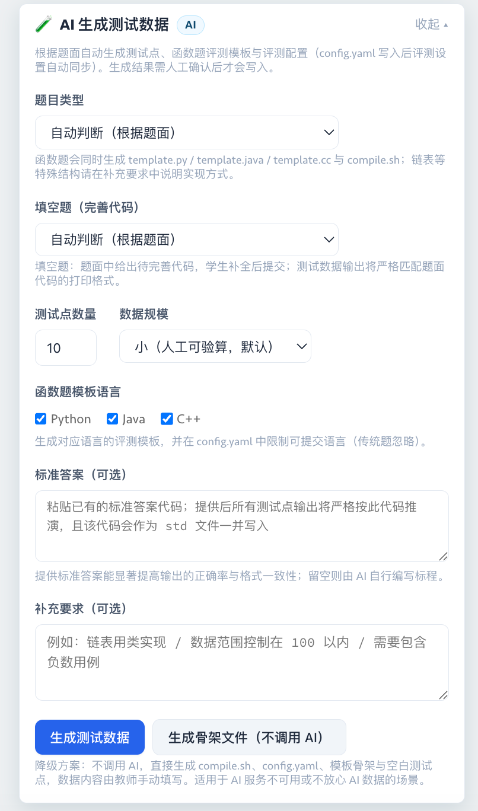

# HydroOJ AI 学习助手

<div align="center">

**中文 | [English](README_en.md)**


</div>

一个以教学为优先的 [HydroOJ](https://github.com/hydro-dev/Hydro) AI 辅助学习插件 — 引导思考，不给答案。支持中英文界面。

## 截图预览


<details>
<summary><b>AI 生成测试数据</b></summary>



</details>

<details>
<summary><b>批量 AI 学习总结</b></summary>


</details>

<details>
<summary><b>管理后台截图</b></summary>


</details>

## 功能特性

### 学生端

- 题目页 AI 对话面板，SSE 实时流式响应，LaTeX 公式自动渲染
- 差异化问题类型：**理解题意** / **理清思路** / **分析错误** / **代码优化**（AC 后专属）
- 多轮对话自动恢复；选中不理解的文字一键追问
- 在成绩表页面查看教师发布的个性化 AI 学习总结

### 教师端

- **AI 生成测试数据** — 在题目文件页（`/p/:pid/files`）根据题面一键生成完整测试数据
  - **沙箱实跑 + 双重验证**：数据生成器与标程在 Hydro 判题沙箱中实际运行产出 `.in`/`.out`，并经过独立暴力解对拍、输入校验、模板实跑与题面样例回归四道机器关卡；验证失败按生成器/标程/模板阶段定向修复
  - 默认根据题面自动混合生成小、中、临界规模并交叉覆盖多项约束；也可定向选择单一规模。新增数据自动避开已有数字测试点并合并生成 `config.yaml`
  - 支持传统题、LeetCode 风格函数题（自动生成 `template.py/java/cc` 与 `compile.sh`）与填空题（完善代码）
  - 可粘贴已有标准答案作为输出的唯一权威；`config.yaml` 评测配置确定性生成，写入后评测设置自动同步
  - 生成的每个代码文件（std.py、generator.py、validator.py 等）首行注明用途；全量预览、可编辑、勾选确认后才写入
  - ⚠️ 对模型能力非常敏感：请在场景模型中为「测试数据生成」配置最强模型；另有骨架模式（不调用 AI）兜底
- **教学分析** — 从全班提交数据发现教学问题，生成可操作的教学建议
  - 8 维度规则引擎（常见错误 / 理解障碍 / 高危学生 / 进步趋势等）+ 错误签名聚类 + 时序行为模式分类
  - LLM 生成 P0/P1/P2 优先级教学建议 — 具体课堂行动，非泛泛而谈；可从 AC 代码自动生成填空练习
- **批量 AI 学习总结** — 成绩表页面一键为每位学生生成个性化学习总结
  - 跨作业历史追踪 + 基于里程碑的智能提交采样；迟到学生可单独补充生成
  - 草稿/发布工作流，SSE 实时进度，停止/继续/重试控制
- 对话记录浏览（时间/题目/班级/学生筛选，自动补全）、有效性指标、CSV 导出（支持脱敏）

### 管理员端

- 统一入口：对话记录/使用统计/AI 配置 Tab 切换
- 多端点 API 管理，自动获取模型列表，拖拽排序优先级，自动 Failover
- 场景模型分配：学生对话/学习总结/教学分析/测试数据生成可分别指定专属模型
- 成本控制：Token 用量追踪、预算限制、成本看板
- 频率限制、自定义系统提示词、一键更新

<details>
<summary><b>安全特性</b></summary>

- 多层级越狱检测（输入/提示词/输出），跨轮次防护
- CSRF Token 校验、SSRF 防护、API Key AES-256-GCM 加密存储
- AI 生成的代码只在 go-judge 沙箱中执行，不进入 Web 进程
- 越狱记录分页审计

</details>

## 安装

```bash
# 克隆（二选一）
git clone https://github.com/AltureT/hydro-ai-helper.git   # GitHub
git clone https://gitee.com/alture/hydro-ai-helper.git      # Gitee（镜像）

cd hydro-ai-helper
npm install
npm run build:plugin

# 安装到 HydroOJ
hydrooj addon add /path/to/hydro-ai-helper
pm2 restart hydrooj
```

验证：访问 `/ai-helper/hello` 返回 JSON 即表示成功。

## 配置

### 环境变量

`ENCRYPTION_KEY`（必需，32 字符）— 加密 API Key：

```bash
export ENCRYPTION_KEY="your-32-character-secret-key!!!"   # 生成：openssl rand -base64 24 | head -c 32
```

`AI_HELPER_UPDATE_CHANNEL`（可选）— 应用内一键更新通道：

- `stable`（默认）— 只更新到正式发布版本（`vX.Y.Z` tag），经 GPG 签名校验。所有真实用户的服务器都应使用此通道。
- `edge` — 跟踪 `main` 分支最新代码，**仅限维护者自己的测试服务器**。

`AI_HELPER_TESTDATA_GENERATION_MODE`（可选）— 测试数据生成是否要求沙箱（`hydrojudge.sandbox_host`）：

- `auto`（默认）— 沙箱可达时实跑验证，不可达时降级直出并明确标注"未验证"
- `sandbox` — 强制要求沙箱，不可用时安全失败
- `direct` — 始终使用直出模式（不推荐）

### 管理员配置

登录后访问 **控制面板 → AI 助手**（`/ai-helper`）→「AI 配置」Tab：

1. **添加 API 端点** — 填写端点名称、API Base URL、API Key → 点击「获取模型」
2. **选择模型与优先级** — 选择模型，拖拽排序；首选不可用时自动切换
3. **场景模型** — 为「测试数据生成」等场景指定专属模型（该场景建议配最强模型）
4. **测试并保存** — 点击「测试连接」验证后保存

## 遥测与隐私

收集**匿名统计数据**（安装数、活跃用户窗口、对话数、按日功能用量、版本），用于 GitHub 徽章和开发参考。完全匿名（随机 UUID，无个人信息，不存储 IP），不收集代码、对话内容或个人数据；仅记录 Cloudflare 粗粒度推断的国家/省份用于地区分布。

<details>
<summary><b>关闭遥测</b></summary>

```javascript
use your_hydro_db
db.ai_plugin_install.updateOne(
  { _id: 'install' },
  { $set: { telemetryEnabled: false } }
)
```

</details>

## 更新日志

<details open>
<summary><b>v3.0.0</b> — 测试数据生成：沙箱实跑 + 双重验证</summary>

- 测试数据不再由 AI 直接给出：生成器与标程在 go-judge 沙箱中实际运行产出 `.in`/`.out`
- 四道机器关卡：独立暴力解对拍、输入校验器逐点校验、函数题模板实跑比对、题面样例回归
- 验证失败自动把失败阶段、出错测试点、输入与 traceback 关键行回喂 AI 修复一轮；教师取消不误报
- 生成的代码文件首行自带用途注释；文件页与场景模型页醒目提示配置最强模型
- 遥测增强：错误上报携带 AI 失败详情、启动失败金丝雀告警、功能用量累计与实例来源省份

</details>

<details>
<summary><b>v2.5.0</b> — AI 生成测试数据（Beta）</summary>

- 根据题面一键生成测试点、函数题评测模板、config.yaml 与参考标程（AI 直出模式）
- 支持传统题、函数题与填空题；可粘贴标准答案作为唯一权威；骨架模式兜底
- 新增「测试数据生成」AI 场景（可单独指定模型链）

</details>

<details>
<summary><b>v2.0.0</b> — 教学分析系统 & 设计升级</summary>

- 8 维度班级分析 + 错误签名聚类 + 时序行为模式（规则引擎优先，成本约为纯 LLM 方案的 1/30）
- LLM 生成 P0/P1/P2 教学建议；从 AC 代码自动生成填空练习
- 学习总结跨作业历史追踪与补充生成；前端统一设计 Token 系统

</details>

<details>
<summary><b>更早版本</b></summary>

- v1.21.0：批量 AI 学习总结（里程碑采样、SSE 进度、草稿/发布）
- v1.19.0–v1.20.0：全面中英文国际化、多维有效性指标、筛选自动补全
- v1.18.0：遥测看板 SPA、错误诊断增强
- v1.14.x–v1.16.x：SSE 流式响应、成本控制、CSRF/SSRF/Prompt 注入防御、安全修复
- v1.0.0–v1.12.0：初始发布、差异化问题类型、多端点 Failover、评测数据集成、竞赛模式

</details>

## 关于

[HydroOJ](https://github.com/hydro-dev/Hydro) 开源在线评测系统的第三方插件。如有问题或建议，欢迎提交 Issue。

## 许可证

MIT License
